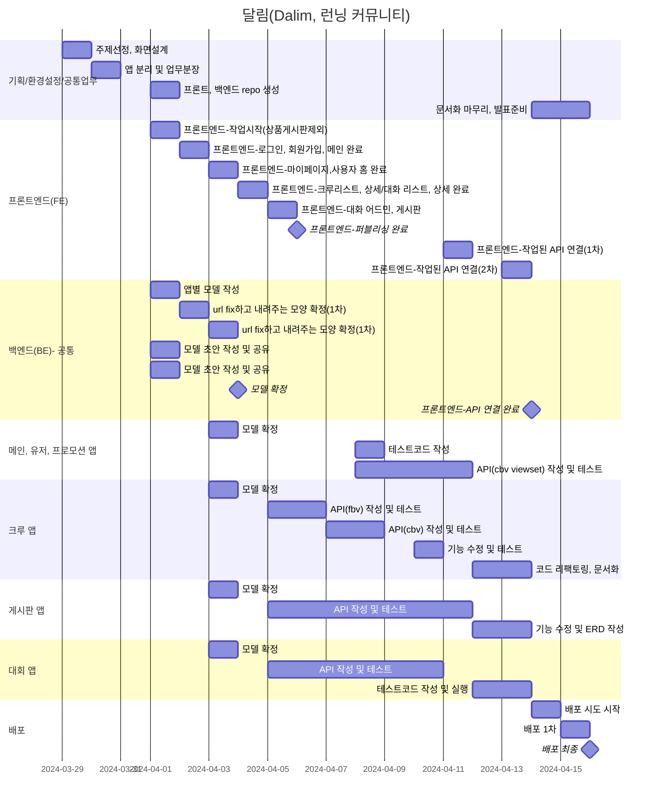
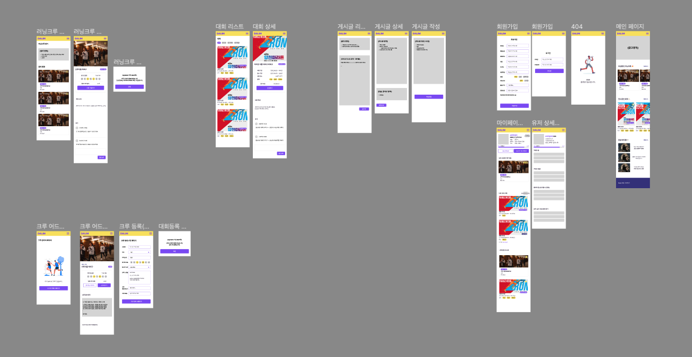
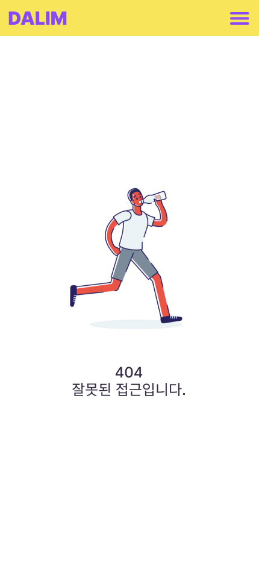
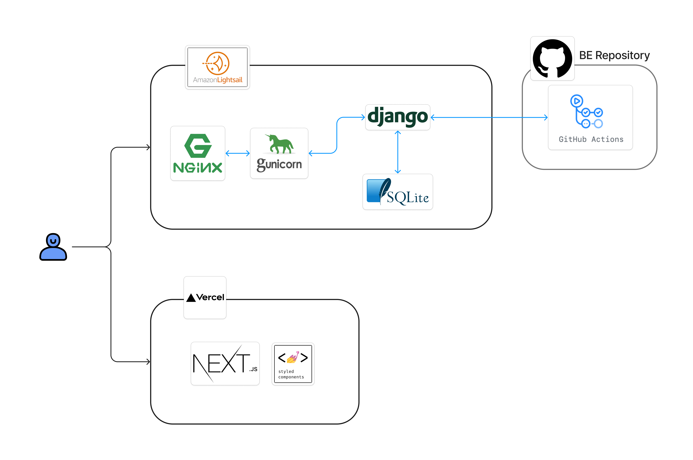

# 🏃 달림 Dalim
- 진행 기간: 24/03/29 ~ 24/04/17
## 1. 목표와 기능

### 1.1 목표
- Django DRF(Django Rest Framework)를 활용한 웹 사이트 개발
- 국내의 러닝 애호가들을 위해 종합적인 서비스 제공
    - 크루, 대회, 커뮤니티 등 러닝과 관련된 서비스 제공
    - 러닝과 관련된 최신 정보 공유 및 소통 플랫폼 구축

### 1.2 기능
- 회원가입 시 "일반회원", "크루 관리자" 로 나누어 사용자의 선택에 따른 서비스 제공
- 자신이 달린 거리를 기록할 수 있고 등급을 통해 체크할 수 있음
- 다양한 카테고리의 게시판을 통해 소통 가능
- 사용자가 지정한 필터링에 따라 크루를 조회하고 가입, 즐겨찾기, 리뷰 가능
- 또는 사용자 본인이 직접 크루를 생성할 수 있음
- 각 대회의 접수 시작/마감일, 대회 시작/마감일과 접수 d-day기능 제공
- 러닝 커뮤니티 게시판과 후기, 훈련일지 등 다양한 카테고리 제공

### 1.3 팀 구성 및 역할분담

| 이름 | 역할분담 | Github-link |
| :-: | --- | --- |
| **유유선** | races 앱 담당<br>프로젝트 문서화 | [@northeast23](https://github.com/northeast23) |
| **임재철** | boards 앱 담당, wiki 작성<br>notion 템플릿, ERD 작성 | [@refelim](https://github.com/refelim) |
| **지민경** | crews 앱 담당<br>프로젝트 문서화 | [@jiminkyung](https://github.com/jiminkyung) |
| **최은선**<br>(팀장) | UI 설계<br>accounts, promotion 앱 담당<br>프론트엔드 개발 및 배포 | [@escape1001](https://github.com/escape1001) |

## 2. 개발 환경 및 배포 URL

### 2.1 개발 환경
#### FE
- vercel, Next.js 14/styled-components

#### BE
- **Tools**

     

- **Web Framework**

      

- **서비스 배포 환경**(예상)

      

- **협업 툴**

       

- **Third-party**
    - django-allauth 0.50.0
    - dj-rest-auth 2.2.4
    - django-cors-headers 4.3.1
    - django-extensions 3.2.3
    - drf-yasg 1.21.7
    - drf-spectacular 0.27.2

### 2.2 배포 URL

- 사이트 URL : https://dalim-main.vercel.app/
(https://cors-anywhere.herokuapp.com/ 사용 필요)
- Swagger URL : http://dalim.duckdns.org/api/schema/swagger-ui/
- 테스트용 계정
    
    ```
    [일반 유저]
    id : test@test.com
    pw : test1234!

    [크루장 유저]
    id : crew@test.com
    pw : test1234!
    ```

### 2.3 URL 구조(마이크로식)

**💠 accounts**
| app: accounts | HTTP Method | 설명 | 로그인 권한 필요 | 작성자 권한 필요 | 추가 권한 |
| :-- | --- | --- | :-: | :-: | --- |
| signup/ | POST | 회원가입 |  |  |  |
| login/ | POST | 로그인 |  |  |  |
| logout/ | POST | 로그아웃 | ✅ |  |  |
| token/refresh/ | POST | 토큰 재발급 | ✅ |  |  |
| mypage/info | GET | 회원정보 | ✅ | ✅ |  |
| mypage/info/\<int:user_id\>/ | PATCH | 회원정보 수정 | ✅ | ✅ |  |
| mypage/record | GET | 달린 기록 보기 | ✅ |  |  |
| mypage/record | POST | 달린 거리 기록 | ✅ |  |  |
| mypage/record/\<int:record_id\>/ | PATCH | 달린 거리 수정 | ✅ | ✅ |  |
| mypage/record/\<int:record_id\>/ | DELETE | 달린 거리 삭제 | ✅ | ✅ |  |
| mypage/crew/ | GET | 내가 신청한 크루 현황 | ✅ |  |  |
| mypage/race/ | GET | 내가 신청한 대회 내역 | ✅ |  |  |
| mypage/race/ | POST | 내 대회 기록 추가 | ✅ |  |  |
| mypage/race/\<int:joined_race_id\>/ | PATCH | 내 대회 기록 추가/수정 | ✅ | ✅ |  |
| mypage/race/\<int:joined_race_id\>/ | DELETE | 내 대회 기록 삭제 | ✅ | ✅ |  |
| mypage/favorites | GET | 나의 관심 리스트 | ✅ |  |  |
| profile/\<int:pk\>/ | GET | 유저 오픈프로필 |  |  |  |
| \<int:pk\>/likes/ | GET | 해당 유저가 좋아요한 글(본인만 볼 수 있음) | ✅ |  | 유저 본인만 가능 |
| \<int:pk\>/reviews/ | GET | 해당 유저가 남긴 크루/대회 후기 |  |  |  |

**💠 races**
| app: races | HTTP Method | 설명 | 로그인 권한 필요 | 작성자 권한 필요 | 추가 권한 |
| :-- | --- | --- | :-: | :-: | --- |
|  | GET | 대회 리스트 |  |  |  |
| \<int:race_id\>/ | GET | 대회 상세 |  |  |  |
| \<int:race_id\>/reviews/ | GET | 대회 리뷰 리스트 |  |  |  |
| \<int:race_id\>/reviews/ | POST | 대회 리뷰 작성 | ✅ |  |  |
| \<int:race_id\>/reviews/\<int:review_id\> | PATCH | 대회 리뷰 수정 | ✅ | ✅ |  |
| \<int:race_id\>/reviews/\<int:review_id\> | DELETE | 대회 리뷰 삭제 | ✅ | ✅ |  |
| \<int:race_id\>/favorite/ | POST | 대회 즐겨찾기 추가/해제 | ✅ |  |  |

**💠 crews**
| app: crews | HTTP Method | 설명 | 로그인 권한 필요 | 작성자 권한 필요 | 추가 권한 |
| :-- | --- | --- | :-: | :-: | --- |
|  | GET | 크루 리스트 |  |  |  |
| \<int:crew_id\>/ | GET | 크루 상세 |  |  |  |
| \<int:race_id\>/join | POST | 크루 가입 신청 | ✅ |  |  |
| \<int:race_id\>/favorite/ | POST | 크루 즐겨찾기 추가/해제 | ✅ |  |  |
| top6/ | GET | 즐겨찾기 순으로 상위 6개의 크루 |  |  |  |
| manage/ | GET | (크루 관리자)크루 리스트 | ✅ |  | 크루 관리자(**”crew”**)로 가입한 회원만 |
| manage/ | POST | (크루 관리자)크루 생성 | ✅ |  | 크루 관리자(**”crew”**)로 가입한 회원만 |
| manage/\<int:crew_id\>/ | GET | (크루 관리자)크루 상세 | ✅ | ✅ | 크루 관리자(**”crew”**)로 가입한 회원만 |
| manage/\<int:crew_id\>/ | PATCH, PUT | (크루 관리자)크루 정보 수정 | ✅ | ✅ | 크루 관리자(**”crew”**)로 가입한 회원만 |
| manage/\<int:crew_id\>/members/ | GET | (크루 관리자)크루 멤버 리스트 | ✅ | ✅ | 크루 관리자(**”crew”**)로 가입한 회원만 |
| manage/\<int:crew_id\>/members/\<int:joined_crew_id\>/ | PATCH | (크루 관리자)크루 멤버의 상태 수정 | ✅ | ✅ | 크루 관리자(**”crew”**)로 가입한 회원만 |
| \<int:crew_id\>/reviews/ | GET | 크루 리뷰 |  |  |  |
| \<int:crew_id\>/reviews/ | POST | 크루 리뷰 작성 | ✅ |  | 현재 크루 멤버(**”member”**)거나, 멤버였던(**”quit”**) 회원만 |
| \<int:crew_id\>/reviews/\<int:review_id\>/ | GET | 특정 리뷰 | ✅ |  |  |
| \<int:crew_id\>/reviews/\<int:review_id\>/ | PATCH, PUT | 특정 리뷰 수정 | ✅ | ✅ |  |
| \<int:crew_id\>/reviews/\<int:review_id\>/ | DELETE | 특정 리뷰 삭제 | ✅ | ✅ |  |

**💠 boards**
| app: boards | HTTP Method | 설명 | 로그인 권한 필요 | 작성자 권한 필요 | 추가 권한 |
| :-- | --- | --- | :-: | :-: | --- |
|  | GET | 게시글 리스트 |  |  |  |
|  | POST | 게시글 작성 | ✅ |  |category는 is_staff와 상관 없이 선택 가능, post_classification를 선택한 경우 event랑 notice을 작성하는 작성자가 is_staff 이다.|
| category/ | GET | 카테고리 |  |  |  |
| \<int:post_id\>/ | GET | 게시글 상세 |  |  |  |
| \<int:post_id\>/ | PATCH, PUT | 게시글 수정 | ✅ | ✅ |  |
| \<int:post_id\>/ | DELETE | 게시글 삭제 | ✅ | ✅ |  |
| \<int:post_id\>/comments/ | GET | 댓글 리스트 |  |  |  |
| \<int:post_id\>/comments/ | POST | 댓글 작성 | ✅ |  |  |
| \<int:post_id\>/comments/\<int:commet_id\>/ | GET | 댓글 가져오기 | ✅ | |  |
| \<int:post_id\>/comments/\<int:commet_id\>/ | PATCH, PUT | 댓글 수정 | ✅ | ✅ |  |
| \<int:post_id\>/comments/\<int:comment_id\>/ | DELETE | 댓글 삭제 | ✅ | ✅ |  |
| \<int:post_id\>/like/ | GET | 게시글 좋아요여부 | ✅ |  |  |
| \<int:post_id\>/like/ | POST | 게시글에 좋아요 추가/해제 | ✅ |  |  |

**💠 promotions**
| app: promotions | HTTP Method | 설명 | 로그인 권한 필요 | 작성자 권한 필요 | 추가 권한 |
| :-- | --- | --- | :-: | :-: | --- |
|  | GET | 광고 영역 |  |  |  |
| post/ | GET | 프로모션할 포스트 |  |  |  |

## 3. 요구사항 명세와 기능 명세
### 3.1 요구사항 명세
- 메인 화면
    - 
- 회원 관리
    - 회원가입, 로그인/로그아웃 기능 구현
    - 가입 시 "일반"/"크루관리자" 역할 선택 가능, 각 역할에 따라 권한 제공
    - 마이페이지
        - 회원정보 수정
        - 달린 기록 CRUD 기능
        - 신청한 대회/크루 현황 확인 가능
        - 대회 기록 추가/수정/삭제 가능
        - 대회/크루 즐겨찾기, 즐겨찾기한 항목들 확인 가능
    - 해당 유저의 오픈프로필(전체 열람 가능)
    - 좋아요한 글 모아보기(본인만 확인 가능)
    - 대회/크루에 남겼던 리뷰 모아보기
- 러닝 대회
    - 대회 리스트, 검색을 통해 필터링된 결과 리스트
    - 상세페이지에서 해당 대회의 상세 정보를 확인할 수 있음
        - 대회명, 대회 주관자 이름, 대회 장소, 대회 소개글
        - 대회 신청일/마감일, 접수 신청일/마감일 제공. 접수 마감일에 대해 D-Day 제공.
    - 대회신청 버튼 클릭시 해당 대회의 사이트로 이동
    - 대회에 대한 리뷰 CRUD 기능
- 러닝 크루
    - 크루 리스트, 검색을 통해 필터링된 결과 리스트
    - 상세페이지에서 해당 크루의 상세 정보를 확인할 수 있음
    - 일반회원으로 가입시(`"normal"`)
        - 크루 가입신청 기능
        - 크루 리뷰 CRUD 기능
    - 크루관리자로 가입시(`"crew"`)
        - 자신이 생성한 크루 관리 기능
        - 크루 정보 수정, 멤버 관리
- 게시판
    - 게시판 리스트, 필터링에 따른 결과 리스트
    - 카테고리별로 게시글 분류
    - 댓글 CRUD 기능
    - 좋아요 기능, 좋아요 갯수 표시
- 프로모션
    - 메인 페이지 배너에 들어갈 내용 리스트
    - 메인 페이지에 들어갈 포스트 리스트

### 3.2 기능 요구사항


## 4. 프로젝트 구조와 개발 일정
### 4.1 프로젝트 구조

``` 
📦dalim_api
 ┣ 📂accounts
 ┃ ┣ 📂migrations
 ┃ ┣ 📂__pycache__
 ┃ ┣ 📜admin.py
 ┃ ┣ 📜apps.py
 ┃ ┣ 📜managers.py
 ┃ ┣ 📜models.py
 ┃ ┣ 📜serializers.py
 ┃ ┣ 📜tests.py
 ┃ ┣ 📜urls.py
 ┃ ┣ 📜views.py
 ┃ ┗ 📜__init__.py
 ┣ 📂boards
 ┃ ┣ 📂migrations
 ┃ ┣ 📂__pycache__
 ┃ ┣ 📜admin.py
 ┃ ┣ 📜apps.py
 ┃ ┣ 📜models.py
 ┃ ┣ 📜permissions.py
 ┃ ┣ 📜serializers.py
 ┃ ┣ 📜tests.py
 ┃ ┣ 📜urls.py
 ┃ ┣ 📜views.py
 ┃ ┗ 📜__init__.py
 ┣ 📂config
 ┃ ┣ 📂__pycache__
 ┃ ┣ 📜asgi.py
 ┃ ┣ 📜constants.py
 ┃ ┣ 📜settings.py
 ┃ ┣ 📜urls.py
 ┃ ┣ 📜wsgi.py
 ┃ ┗ 📜__init__.py
 ┣ 📂crews
 ┃ ┣ 📂migrations
 ┃ ┣ 📂__pycache__
 ┃ ┣ 📜admin.py
 ┃ ┣ 📜apps.py
 ┃ ┣ 📜models.py
 ┃ ┣ 📜permissions.py
 ┃ ┣ 📜serializers.py
 ┃ ┣ 📜tests.py
 ┃ ┣ 📜urls.py
 ┃ ┣ 📜views.py
 ┃ ┗ 📜__init__.py
 ┣ 📂media
 ┃ ┗ 📂README
 ┣ 📂promotions
 ┃ ┣ 📂migrations
 ┃ ┣ 📂__pycache__
 ┃ ┣ 📜admin.py
 ┃ ┣ 📜apps.py
 ┃ ┣ 📜models.py
 ┃ ┣ 📜serializers.py
 ┃ ┣ 📜tests.py
 ┃ ┣ 📜urls.py
 ┃ ┣ 📜views.py
 ┃ ┗ 📜__init__.py
 ┣ 📂races
 ┃ ┣ 📂migrations
 ┃ ┣ 📂__pycache__
 ┃ ┣ 📜admin.py
 ┃ ┣ 📜apps.py
 ┃ ┣ 📜models.py
 ┃ ┣ 📜serializers.py
 ┃ ┣ 📜tests.py
 ┃ ┣ 📜urls.py
 ┃ ┣ 📜views.py
 ┃ ┗ 📜__init__.py
 ┣ 📜.gitignore
 ┣ 📜db.sqlite3
 ┣ 📜manage.py
 ┣ 📜README.md
 ┗ 📜requirements.txt
```

### 4.2 개발 일정(WBS)



## 5. 와이어프레임 / UI / BM

### 5.1 와이어프레임
[Figma](https://www.figma.com/file/LQwXLQmLMsmwibWOZLfKVp/orm_final?type=design&node-id=0-1&mode=design&t=PUgyi3Lb3lJeJlQ9-0)



### 5.2 화면 설계

<details>
    <summary>💠 어카운트 앱</summary>
    <table>
        <tbody>
            <tr>
                <td align = "center">메인페이지</td>
                <td align = "center">회원가입</td>
            </tr>
            <tr>
                <td align = "center" valign="Top">
            
                </td>
                <td align = "center" valign="Top">
                    
                </td>
            </tr>
            <tr>
                <td align = "center" valign="Top">마이페이지(일반유저)</td>
                <td align = "center" valign="Top">유저 상세페이지(퍼블릭)</td>
            </tr>
            <tr>
                <td align = "center" valign="Top">
                    
                </td>
                <td align = "center" valign="Top">
                    
                </td>
            </tr>
            <tr>
                <td align = "center" valign="Top">로그인</td>
                <td align = "center" valign="Top">404</td>
            </tr>
            <tr>
                <td align = "center" valign="Top">
                    
                </td>
                <td align = "center" valign="Top">
                    
                </td>
            </tr>  
        </tbody>
    </table>
</details>

<details>
    <summary>💠 크루 앱</summary>
    <table>
        <tbody>
            <tr>
                <td align = "center" valign="Top">러닝크루 리스트</td>
                <td align = "center" valign="Top">러닝크루 상세</td>
            </tr>
            <tr>
                <td align = "center" valign="Top">
                    
                </td>
                <td align = "center" valign="Top">
                    
                </td>
            </tr>
            <tr>
                <td align = "center" valign="Top">러닝크루 신청완료</td>
                <td align = "center" valign="Top"> </td>
            </tr>
            <tr>
                <td align = "center" valign="Top">
                    
                </td>
                <td align = "center" valign="Top">
                    
                </td>
            </tr>
            <tr>
                <td align = "center" valign="Top">크루 어드민 최초</td>
                <td align = "center" valign="Top">크루 어드민(크루 관리자) </td>
            </tr>
            <tr>
                <td align = "center" valign="Top">
                    
                </td>
                <td align = "center" valign="Top">
                    
                </td>
            </tr>   
            <tr>
                <td align = "center" valign="Top">크루 등록(크루관리자)</td>
                <td align = "center" valign="Top">크루 등록 완료 </td>
            </tr>
            <tr>
                <td align = "center" valign="Top">
                    
                </td>
                <td align = "center" valign="Top">
                    
                </td>
            </tr>   
        </tbody>
    </table>
</details> 

<details>
    <summary>💠 게시판 앱</summary>
    <table>
        <tbody>
            <tr>
                <td align = "center" valign="Top">게시글 리스트</td>
                <td align = "center" valign="Top">게시글 상세 </td>
            </tr>
            <tr>
                <td align = "center" valign="Top">
                    
                </td>
                <td align = "center" valign="Top">
                    
                </td>
            </tr>
            <tr>
                <td align = "center" valign="Top">게시글 작성</td>
                <td align = "center" valign="Top"> </td>
            </tr>
            <tr>
                <td align = "center" valign="Top">
                    
                </td>
                <td align = "center" valign="Top">
                    
                </td>
            </tr>
        </tbody>
    </table>
</details> 

<details>
    <summary>💠 대회 앱</summary>
    <table>
        <tbody>
            <tr>
                <td align = "center" valign="Top">대회 리스트</td>
                <td align = "center" valign="Top">대회 상세 </td>
            </tr>
            <tr>
                <td align = "center" valign="Top">
                    
                </td>
                <td align = "center" valign="Top">
                    
                </td>
            </tr>
        </tbody>
    </table>
</details> 


## 6. 데이터베이스 모델링(ERD)

[Dalim ERD 바로가기](https://www.erdcloud.com/d/ZSCKyEmWjLbwPY2vc)

## 7. Architecture


## 8. 메인 기능
### 8-1. 크루 서치 및 가입 기능
<br/>
- 현재 "모집중"인 크루 리스트를 보여줍니다. 검색 기능과 요일/지역 필터링 기능을 통해 원하는 크루를 쉽게 찾을 수 있습니다.
- 크루 상세 페이지에서는 크루의 상세 정보를 확인할 수 있으며, 관심 있는 크루에 가입 신청을 할 수 있습니다.
- 크루 즐겨찾기 기능을 통해 마음에 드는 크루를 저장할 수 있고, 즐겨찾기한 크루들은 마이페이지에서 쉽게 확인 할 수 있습니다.

### 8-2. 크루 리뷰 기능
<br/>
- 현재 크루 멤버인 회원, 탈퇴한 회원들은 크루 활동에 대한 리뷰를 작성할 수 있습니다.
- 이를 통해 크루에 대한 피드백을 공유하고, 다른 사용자들에게 참고 정보를 제공할 수 있습니다.
- 리뷰는 작성자만 수정 및 삭제할 수 있게끔 구현하였습니다.

### 8-3. 크루 관리

<br/>
- 크루 관리자는 크루를 생성, 크루의 정보를 수정할 수 있는 권한을 가지고 있습니다.
- 또한 크루 멤버 관리 기능을 통해 크루 회원들의 상태를 효율적으로 관리할 수 있도록 하였습니다.

### 8-4. 러닝 기록 및 레벨시스템
<br/>
- 회원이 자신의 러닝 거리를 기록하고, 수정 및 삭제할 수 있습니다.
- 이 러닝 기록을 바탕으로 회원은 본인의 러닝 패턴, 진척도를 파악 할 수 있습니다.
- 레벨 시스템을 더해 회원의 총 러닝 거리를 바탕으로 레벨을 부여할 수 있도록 구현했습니다.

## 9. 에러와 에러 해결
### 💠 최은선 
1. 프론트엔드와 연결 시 반복되는 500에러 
    - 문제 원인: url 끝의 “/” 유무
    - 해결 방법: 프론트에서 요청하는 URL 수정
2. 회원가입 시 username, nickname과 같은 값을 입력해 줬음에도 DB에 들어오지 않는 현상
    - 문제원인: dj_rest_auth.registration.urls로 만든 signup과 customUser 모델이 연결되지 않음
    - 해결방법:CustomRegisterView과 CustomRegisterSerializer 를 만들어 signup URL에 연결

```python
[기존코드]
# accounts/urls.py
urlpatterns = [
    path("signup/", include("dj_rest_auth.registration.urls")),
    ...
]
```

```python
[수정된 코드]
# accounts/urls.py
urlpatterns = [
    path("signup/", views.CustomRegisterView.as_view(), name="account_signup"),

    ...
]


# accounts/views.py
from dj_rest_auth.registration.views import RegisterView

class CustomRegisterView(RegisterView):
    serializer_class = CustomRegisterSerializer
    
# accounts/serializers.py
from dj_rest_auth.registration.serializers import RegisterSerializer

class CustomRegisterSerializer(RegisterSerializer):
    email = serializers.EmailField(required=True)
    nickname = serializers.CharField(required=True)
    birth_date = serializers.DateField(required=True)
    gender = serializers.CharField(required=True)
    user_type = serializers.CharField(required=True)
    location_city = serializers.CharField(required=True)
    location_district = serializers.CharField(required=True)
    phone_number = serializers.CharField(required=True)

    def custom_signup(self, request, user):
        user.email = self.validated_data.get('email')
        user.nickname = self.validated_data.get('nickname')
        user.birth_date = self.validated_data.get('birth_date')
        user.gender = self.validated_data.get('gender')
        user.user_type = self.validated_data.get('user_type')
        user.location_city = self.validated_data.get('location_city')
        user.location_district = self.validated_data.get('location_district')
        user.phone_number = self.validated_data.get('phone_number')
        user.save()
```


### 💠 지민경
1. url 작성 시 더블슬래쉬 오류(`//`)
    - 문제 원인: URL 패턴 매칭 순서. Django의 URL 라우터는 첫 번째로 일치하는 패턴에 대해 해당 뷰를 호출하는 특징이 있음.
    - 해결 방법: URL 선언 순서 변경. 구체적인 패턴순으로 내림차순 정렬해줌. 

```python
router = DefaultRouter()
router.register(r"manage/(?P<crew_id>\d+)/members", views.CrewMemberViewSet, basename="joinedcrew")
router.register(r"(?P<crew_id>\d+)/reviews", views.CrewReviewViewSet, basename="crewreview")
router.register("manage", views.ManagerCrewViewSet, basename="manage_crew")
```

2. Django에서 선언해준 자료형 값과 swagger ui에서 확인한 자료형값이 다른 문제.
    - 문제 원인 : Django에서 SerializerMethodField를 사용할 때, 해당 메서드가 반환하는 값의 타입(자료형)을 명시적으로 지정하지 않으면 문자열로 간주.
    - 해결 방법 : 없음. 실질적으로 문제가 되는 코드가 아니었다.
    - 추가 설명
        - Django 코드 내에서는 SerializerMethodField를 사용하여 커스텀 필드를 정의할 때, 해당 메서드에서 반환하는 값의 ‘실제’ 타입을 사용.
        - 하지만 Swagger ui는 기본적으로 문자열(string)으로 간주한다.
        - 따라서 예시 데이터값을 request하지 않는 한 SerializerMethodField를 사용한 필드는 문자열로 표시됨.
      
```python
class CrewListSerializer(CrewSerializerMixin, serializers.ModelSerializer):
    is_opened = serializers.CharField(source="get_status_display")
    meet_days = serializers.SerializerMethodField()
    is_favorite = serializers.SerializerMethodField()
    member_count = serializers.SerializerMethodField()
    favorite_count = serializers.IntegerField(read_only=True)

    class Meta:
        model = Crew
        fields = ["id", "name", "thumbnail_image", "member_count", "is_favorite", "location_city", "location_district", "meet_days", "meet_time", "is_opened", "favorite_count"]
```

            
### 💠 임재철
1. Get /boards/{post_id} 에 로그인을 안하고 들어가면 문제 없이 API가 나오는데 로그인을 하고 Get /boards/{post_id} 들어가면 "AttributeError at /boards/1/ 'ManyRelatedManager' object has no attribute 'posted_likes' " 오류 발생
    - 해결 과정 : 많은 사람들에게 문제를 공유하고 이에 맞는 코칭을 받음. 그래도 정리가 되지 않아서 API 주고 받는 과정을 도식화(아래 그림 참고). 도식화를 그리니 생각했던 로직과 코딩이 다르다고 한 눈에 파악됨. 그리고 Serializer로 타 model에 있는 값들 주고 받지 않는 점, def get_함수 의 쓰임새를 참고해서 코드 경량화에 도전함. 
1. Get /boards/{post_id} 에 로그인을 안하고 들어가면 문제 없이 api가 나오는데 로그인을 하고 Get /boards/{post_id} 들어가면 "AttributeError at /boards/1/ 'ManyRelatedManager' object has no attribute 'posted_likes' " 오류 발생
    - 해결 과정 : 많은 사람들에게 문제를 공유하고 이에 맞는 코칭을 받음. 그래도 정리가 되지 않아서 API 주고 받는 과정을 도식화(아래 그림 참고). 도식화를 그리니 생각했던 로직과 코딩이 다르다고 한 눈에 파악됨. 그리고 Serializer로 타 model에 있는 값들 주고 받지 않는 점, def get_함수 의 쓰임새를 참고해서 코드 경량화에 도전함.
    - 해결 방법 : API가 나오는데 꼭 필요하다고 생각한 LikeSerializers 를 삭제하고,PostListSerializers의 코드를 정리함.


### 💠 유유선
1. SerializerMethodField(대회 코스) 의 값이 하나만 있는 경우, (리스트가 아닌) string 값으로 전달됨.  
    - 문제 원인 : 시리얼라이저에서 해당 메쏘드가 정의되지 않았음. 
    - 해결 방법 : 시리얼라이저에서 필드를 정의하고 get_ method 로 추가함.
 

## 11. 개발하며 느낀점 (회고록)
### 💠 최은선
이전에 개발자로 근무하고 사이드프로젝트를 진행하며 개인적으로 좋다고 느꼈던 개발문화와 리모트 협업의 팁을 팀원분들과 최대한 나누고자 했습니다. 실제로 잘 따라와주셔서 예상 일정을 맞출 수 있었고, 함께 만족할 수 있는 프로젝트 경험이 된 것 같아 기쁩니다.

저 또한 혼자 코딩을 잘 치는 개발자보다는 협업을 잘 하는 개발자가 되는 것의 중요성을 체감했습니다.

또한 fbv로 작성한 코드를 viewset으로 리팩토링 하며 viewset을 이용했을 때 적합한 URL 패턴을 이해하게 된 점이 만족스럽습니다. 앞으로 새로 하게 될 프로젝트가 기대됩니다.


### 💠 지민경
개인 프로젝트할때에도 느꼈던거지만 초반 계획 수립, 기능 정의 부분이 중요한것같습니다.
‘얼마나 세밀하고 구체적으로 계획했는가’에 따라 개발 속도가 달라지는것같아요.

또 나무보다는 숲을 보는 능력을 키우게 된 것 같습니다. 한가지 기능에 매달려 끙끙대다가 충분히 할 수 있었던 기능들도 못끝내는 경우가 있었는데, 이번에는 팀원분들 덕분에 그런 상황을 면할 수 있었습니다.

한가지 더 적자면 AI를 이용해 코딩을 하는게 맞는건가? 라는 의문점이 들곤 했었으나 조금은 해소된 듯 합니다. 내가 더 많이 알수록 AI에게 하는 질문도 예리해지고 구체적으로 변하는 느낌을 받았거든요.

좋은 팀원분들과 함께 할 수 있어서 행복했습니다.


### 💠 임재철
처음에는 어렵게만 느껴졌던 코딩이였습니다. 그러나 멈추지 않고 계속 두드렸고 하나를 풀면 또 모르는 것이 하나가 나오지만, 하나하나 문제를 해결 하는 과정을 겪고 나니 개발이 저의 적성이 맞다는 걸 느꼈습니다.

부트캠프가 끝난 이후에도 이러한 시행착오를 계속 겪게 되겠지만, 프로젝트를 성공적으로 끝 마칠 수 있어서 자신감을 얻는 시간 이였습니다. 같이 하며 도움 주신 팀원분, 멘토님, 강사님 감사드립니다. 


### 💠 유유선 
초기에 주제를 정한 후, 와이어프레임 작업을 통해서 작업 범위를 구체적으로 볼 수 있었던 점이 프로젝트 범위를 정하는 데 많이 도움이 되었습니다. 범위를 현실적으로 잡아서 제 시간에 마무리가 가능했다고 느꼈습니다. 
개인적으로는 팀원들이 기다려줘서 고마웠습니다. 
