# 🏃 달림 Dalim
- 진행 기간: 24/03/29 ~ 24/04/17
## 1. 목표와 기능

### 1.1 목표
- Django DRF(Django Rest Framework)를 활용해 안정적이고 효율적인 웹 사이트 개발
- 국내의 러닝 애호가들, 전문 선수들을 위해 종합적인 서비스 제공
    - 크루, 대회, 상품 등 러닝과 관련된 서비스 제공
- 러닝 커뮤니티의 활성화와 발전 → 러닝 문화 확산
    - 러닝과 관련된 최신 정보 공유 및 소통 플랫폼 구축

### 1.2 기능
- 회원가입 시 "일반회원", "크루 관리자" 로 나누어 사용자의 선택에 따른 서비스 제공
- 자신이 달린 거리를 기록할 수 있고 등급을 통해 체크할 수 있음
- 다양한 카테고리의 게시판을 통해 소통 가능
- 사용자가 지정한 필터링에 따라 크루를 조회하고 가입, 즐겨찾기, 리뷰 가능
- 또는 사용자 본인이 직접 크루를 생성할 수 있음
- 각 대회의 접수 시작/마감일, 대회 시작/마감일과 접수 d-day기능 제공
- 러닝 관련 상품, 해당 상품의 후기 제공

### 1.3 팀 구성

| 이름 | 유유선 | 임재철 | 지민경 | 최은선 |
| :-- | --- | --- | --- | --- |
| **GitHub-Link** | [@northeast23](https://github.com/northeast23) | [@refelim](https://github.com/refelim) | [@jiminkyung](https://github.com/jiminkyung) | [@escape1001](https://github.com/escape1001) |

## 2. 개발 환경 및 배포 URL

### 2.1 개발 환경

- **Tools**

     

- **Web Framework**

      

- **서비스 배포 환경**(예상)

      

- **협업 툴**

       

- **Third-party**
    - django-allauth 0.50.0
    - dj-rest-auth 2.2.4
    - django-cors-headers 4.3.1
    - django-extensions 3.2.3
    - drf-yasg 1.21.7
    - drf-spectacular 0.27.2

### 2.2 배포 URL

- [배포 URL](https://github.com/orm-final-101/dalim_api)
- 테스트용 계정
    
    ```
    id : test@test.test
    pw : test11!!
    ```

### 2.3 URL 구조(마이크로식)

**💠 accounts**
| app: accounts | HTTP Method | 설명 | 로그인 권한 필요 | 작성자 권한 필요 | 추가 권한 |
| :-- | --- | --- | :-: | :-: | --- |
| signup/ | POST | 회원가입 |  |  |  |
| login/ | POST | 로그인 |  |  |  |
| logout/ | POST | 로그아웃 | ✅ |  |  |
| token/refresh/ | POST | 토큰 재발급 | ✅ |  |  |
| mypage/info | GET | 회원정보 | ✅ | ✅ |  |
| mypage/info | PATCH, PUT | 회원정보 수정 | ✅ | ✅ |  |
| mypage/record | GET | 달린 기록 보기 | ✅ |  |  |
| mypage/record | POST | 달린 거리 기록 | ✅ |  |  |
| mypage/record/\<int:record_id\>/ | PATCH, PUT | 달린 거리 수정 | ✅ | ✅ |  |
| mypage/record/\<int:record_id\>/ | DELETE | 달린 거리 삭제 | ✅ | ✅ |  |
| mypage/crew/ | GET | 내가 신청한 크루 현황 | ✅ |  |  |
| mypage/race/ | GET | 내가 신청한 대회 내역 | ✅ |  |  |
| mypage/race/ | POST | 내가 신청한 대회 내역 추가 | ✅ |  |  |
| mypage/race/\<int:joined_race_id\>/ | PATCH, PUT | 내 대회 기록 추가/수정 | ✅ | ✅ |  |
| mypage/race/\<int:joined_race_id\>/ | DELETE | 내 대회 기록 삭제 | ✅ | ✅ |  |
| mypage/favorites | GET | 나의 관심 리스트 | ✅ |  |  |
| \<int:pk\>/profile/ | GET | 유저 오픈프로필 |  |  |  |
| \<int:pk\>/likes/ | GET | 해당 유저가 좋아요한 글(본인만 볼 수 있음) | ✅ |  | 유저 본인만 가능 |
| \<int:pk\>/reviews/ | GET | 해당 유저가 남긴 크루/대회 후기 |  |  |  |

**💠 races**
| app: races | HTTP Method | 설명 | 로그인 권한 필요 | 작성자 권한 필요 | 추가 권한 |
| :-- | --- | --- | :-: | :-: | --- |
|  | GET | 대회 리스트 |  |  |  |
| \<int:race_id\>/ | GET | 대회 상세 |  |  |  |
| \<int:race_id\>/reviews/ | GET | 대회 리뷰 리스트 |  |  |  |
| \<int:race_id\>/reviews/ | POST | 대회 리뷰 작성 | ✅ |  |  |
| \<int:race_id\>/reviews/\<int:review_id\> | PATCH, PUT | 대회 리뷰 수정 | ✅ | ✅ |  |
| \<int:race_id\>/reviews/\<int:review_id\> | DELETE | 대회 리뷰 삭제 | ✅ | ✅ |  |
| \<int:race_id\>/favorite/ | POST | 대회 즐겨찾기 추가/해제 | ✅ |  |  |

**💠 crews**
| app: crews | HTTP Method | 설명 | 로그인 권한 필요 | 작성자 권한 필요 | 추가 권한 |
| :-- | --- | --- | :-: | :-: | --- |
|  | GET | 크루 리스트 |  |  |  |
| \<int:crew_id\>/ | GET | 크루 상세 |  |  |  |
| \<int:race_id\>/join | POST | 크루 가입 신청 | ✅ |  |  |
| \<int:race_id\>/favorite/ | POST | 크루 즐겨찾기 추가/해제 | ✅ |  |  |
| top6/ | GET | 즐겨찾기 순으로 상위 6개의 크루 |  |  |  |
| manage/ | GET | (크루 관리자)크루 리스트 | ✅ |  | 크루 관리자(**”crew”**)로 가입한 회원만 |
| manage/ | POST | (크루 관리자)크루 생성 | ✅ |  | 크루 관리자(**”crew”**)로 가입한 회원만 |
| manage/\<int:crew_id\>/ | GET | (크루 관리자)크루 상세 | ✅ | ✅ | 크루 관리자(**”crew”**)로 가입한 회원만 |
| manage/\<int:crew_id\>/ | PATCH, PUT | (크루 관리자)크루 정보 수정 | ✅ | ✅ | 크루 관리자(**”crew”**)로 가입한 회원만 |
| manage/\<int:crew_id\>/members/ | GET | (크루 관리자)크루 멤버 리스트 | ✅ | ✅ | 크루 관리자(**”crew”**)로 가입한 회원만 |
| manage/\<int:crew_id\>/members/\<int:joined_crew_id\>/ | PATCH | (크루 관리자)크루 멤버의 상태 수정 | ✅ | ✅ | 크루 관리자(**”crew”**)로 가입한 회원만 |
| \<int:crew_id\>/reviews/ | GET | 크루 리뷰 |  |  |  |
| \<int:crew_id\>/reviews/ | POST | 크루 리뷰 작성 | ✅ |  | 현재 크루 멤버(**”member”**)거나, 멤버였던(**”quit”**) 회원만 |
| \<int:crew_id\>/reviews/\<int:review_id\>/ | GET | 특정 리뷰 | ✅ |  |  |
| \<int:crew_id\>/reviews/\<int:review_id\>/ | PATCH, PUT | 특정 리뷰 수정 | ✅ | ✅ |  |
| \<int:crew_id\>/reviews/\<int:review_id\>/ | DELETE | 특정 리뷰 삭제 | ✅ | ✅ |  |

**💠 boards**
| app: boards | HTTP Method | 설명 | 로그인 권한 필요 | 작성자 권한 필요 | 추가 권한 |
| :-- | --- | --- | :-: | :-: | --- |
|  | GET | 게시글 리스트 |  |  |  |
|  | POST | 게시글 작성 | ✅ |  |  |
| category/ | GET | 카테고리 |  |  |  |
| \<int:post_id\>/ | GET | 게시글 상세 |  |  |  |
| \<int:post_id\>/ | PATCH, PUT | 게시글 수정 | ✅ | ✅ |  |
| \<int:post_id\>/ | DELETE | 게시글 삭제 | ✅ | ✅ |  |
| \<int:post_id\>/comments/ |  | 댓글 리스트 |  |  |  |
| \<int:post_id\>/comments/ |  | 댓글 작성 | ✅ |  |  |
| \<int:post_id\>/comments/\<int:commet_id\>/ |  | 댓글 수정 | ✅ | ✅ |  |
| \<int:post_id\>/comments/\<int:comment_id\>/ |  | 댓글 삭제 | ✅ | ✅ |  |
| \<int:post_id\>/like/ | POST | 게시글에 좋아요 추가/해제 | ✅ |  |  |

**💠 promotions**
| app: promotions | HTTP Method | 설명 | 로그인 권한 필요 | 작성자 권한 필요 | 추가 권한 |
| :-- | --- | --- | :-: | :-: | --- |
|  | GET | 광고 영역 |  |  |  |
| post/ | GET | 프로모션할 포스트 |  |  |  |

## 3. 요구사항 명세와 기능 명세
pass

## 4. 프로젝트 구조와 개발 일정

### 4.1 프로젝트 구조
```
📦accounts
 ┣ 📂migrations
 ┣ 📂__pycache__
 ┣ 📜admin.py
 ┣ 📜apps.py
 ┣ 📜managers.py
 ┣ 📜models.py
 ┣ 📜serializers.py
 ┣ 📜tests.py
 ┣ 📜urls.py
 ┣ 📜views.py
 ┗ 📜__init__.py
📦boards
 ┣ 📂migrations
 ┣ 📂__pycache__
 ┣ 📜admin.py
 ┣ 📜apps.py
 ┣ 📜models.py
 ┣ 📜permissions.py
 ┣ 📜serializers.py
 ┣ 📜tests.py
 ┣ 📜urls.py
 ┣ 📜views.py
 ┗ 📜__init__.py
📦config
 ┣ 📂__pycache__
 ┣ 📜asgi.py
 ┣ 📜constants.py
 ┣ 📜settings.py
 ┣ 📜urls.py
 ┣ 📜wsgi.py
 ┗ 📜__init__.py
📦crews
 ┣ 📂migrations
 ┣ 📂__pycache__
 ┣ 📜admin.py
 ┣ 📜apps.py
 ┣ 📜models.py
 ┣ 📜permissions.py
 ┣ 📜serializers.py
 ┣ 📜tests.py
 ┣ 📜urls.py
 ┣ 📜views.py
 ┗ 📜__init__.py
📦promotions
 ┣ 📂migrations
 ┣ 📂__pycache__
 ┣ 📜admin.py
 ┣ 📜apps.py
 ┣ 📜models.py
 ┣ 📜serializers.py
 ┣ 📜tests.py
 ┣ 📜urls.py
 ┣ 📜views.py
 ┗ 📜__init__.py
📦races
 ┣ 📂migrations
 ┃ 📂__pycache__
 ┣ 📜admin.py
 ┣ 📜apps.py
 ┣ 📜models.py
 ┣ 📜serializers.py
 ┣ 📜tests.py
 ┣ 📜urls.py
 ┣ 📜views.py
 ┗ 📜__init__.py
 📜.gitignore
 ┣📜db.sqlite3
 ┣📜manage.py
 ┣📜README.md
 ┗📜requirements.txt
```

### 4.2 개발 일정(WBS)

```mermaid
gantt
    title 달림(Dalim, 런닝 커뮤니티)
    dateFormat  YY-MM-DD

    section 기획/환경설정/공통업무
    주제선정, 화면설계   :24-03-29, 1d
    앱 분리 및 업무분장 : a1, 24-03-30, 1d
    프론트, 백엔드 repo 생성: a2, 24-04-01, 1d
    문서화 마무리, 발표준비: 24-04-14, 2d

    section 프론트엔드(FE)
    프론트엔드-작업시작(상품게시판제외): 24-04-01, 1d
    프론트엔드-로그인, 회원가입, 메인 완료:24-04-02, 1d
    프론트엔드-마이페이지,사용자 홈 완료:24-04-03, 1d
    프론트엔드-크루리스트, 상세/대화 리스트, 상세 완료:24-04-04, 1d
    프론트엔드-대화 어드민, 게시판: 24-04-05, 1d
    프론트엔드-퍼블리싱 완료: milestone, isadded, 24-04-06, 0d
    프론트엔드-작업된 API 연결(1차): 24-04-11, 1d 
    프론트엔드-작업된 API 연결(2차): 24-04-13, 1d
    
    section 백엔드(BE)- 공통 
    앱별 모델 작성: b1, 24-04-01, 1d
    url fix하고 내려주는 모양 확정(1차):after b1, 24-04-02, 1d
    url fix하고 내려주는 모양 확정(1차):after b1, 24-04-03, 1d
    모델 초안 작성 및 공유: after b1, 24-04-01, 1d
    모델 초안 작성 및 공유: after b1, 24-04-01, 1d
    모델 확정: milestone, isadded, 24-04-04, 0d
    프론트엔드-API 연결 완료: milestone, isadded, 24-04-14, 0d   

    section 메인, 유저, 프로모션 앱
    모델 확정:after b1, 24-04-03, 1d
    테스트코드 작성: b2, 24-04-08, 1d    
    API(cbv viewset) 작성 및 테스트: after b2, 24-04-08, 4d    

    section 크루 앱
    모델 확정:after a2, 24-04-03, 1d
    API(fbv) 작성 및 테스트: c1, 24-04-05, 2d    
    API(cbv) 작성 및 테스트: after c1, 24-04-07, 2d 
    기능 수정 및 테스트: 24-04-10, 1d   
    코드 리팩토링, 문서화: 24-04-12, 2d    

    section 게시판 앱 
    모델 확정:after a1, 24-04-03, 1d
    API 작성 및 테스트: d2, 24-04-05, 7d
    기능 수정 및 ERD 작성: 24-04-12, 2d

    section 대회 앱 
    모델 확정: after a1, 24-04-03, 1d
    API 작성 및 테스트: r1, 24-04-05, 6d
    테스트코드 작성 및 실행: after r1, 24-04-12, 2d

    section 배포
    배포 시도 시작:a1, 24-04-14, 1d
    배포 1차: 24-04-15, 1d
    배포 최종: milestone, isadded, 24-04-16, 0d
```



## 5. 역할 분담
pass

## 6. 와이어프레임 / UI / BM

### 6.1 와이어프레임


### 6.2 화면 설계

* 어카운트 앱

|  |   |
|---|---|
|메인페이지 | 회원가입  | 
|  |  | 
| 마이페이지|유저 상세 페이지   |
|  |  | 
| 로그인 | 404 | 
| | 


* 크루 앱

|  |   |
|---|---|
|  러닝크루리스트|러닝크루 상세   |
| || 
| 러닝크루 신청 완료|   |
| |   |
| 크루 어드민 최초| 크루 어드민(크루 관리자)   |
| |   |
|크루 등록(크루관리자)|크루 등록 완료|
|| |


* 게시판 앱 

|  |   |
|---|---|
|게시글 리스트 | 게시글 상세  |
| |   |
|게시글 작성  |   |
|  |   |


* 대회 앱

|  |   |
|---|---|
| 대회 리스트 | 대회 상세 |
| |  |


 

## 7. 데이터베이스 모델링(ERD)
pass

## 8. Architecture
pass

## 9. 메인 기능
pass

## 10. 에러와 에러 해결
pass

## 11. 개발하며 느낀점 (회고록)
pass
